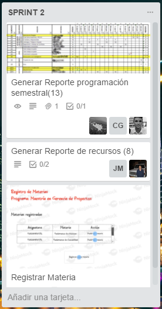

**EPIC-WINO**
=========
#### **Periodo Académico: 2017-1**
#### **Curso: Proceso De Desarrollo De Software**
#### **Integrantes:**
 - Maria Camila Gomez Ramirez - ***Scrum team member***
 - Fabian Augusto Ardila Rodriguez - ***Scrum team member***
 - Alejandro Anzola Avila - ***Scrum Master***
 - Juan Jose Andrade Pardo - ***Scrum team member***
 - Jossie Esteban Murcia Triviño - ***Scrum team member***
#### **Profesor:**
 - Hector Fabio Cadavid Rengifo - ***Dueño de Producto***
#### **Descripción del Producto:**
> *Este producto esta enfocado a resolver un problema real que posee la Unidad de Proyectos de la Escuela Colombiana de Ingeniería Julio Garavito, respecto a la generación de una plataforma de programación de clases y gestión de recursos de programas de postgrado, donde simplifica la labor de programación de cursos cada periodo académico y la consolidación de datos históricos, con el fin de generar reportes estratégicos para los procesos de mejoramiento continuo de esta unidad, con las presentes funcionalidades.*

> **Funcionalidades**:
> - En esta funcionalidad, el usuario puede acceder a cualquier funcionalidad de la plataforma, hay varios botones los cuales al darles *click* los dirige a la respectiva vista.

> - En esta funcionalidad se pueden consultar todas las asignaturas de un programa (para el que se elige el programa y el nivel, ya sea de Maestría o de Especialización) en determinado periodo (para el cual se debe indicar el año y el semestre). Así mismo para cada asignatura se despliega su lista de materias correspondientes.

> - En esta, se registra una nueva materia eligiendo el programa y asignatura al cual va a pertenecer, así mismo se podrá ver que quedo registrada al dar *click* en el botón de Registrar Materia el cual conduce
a las Materias Registradas o se puede cancelar el registro

> - En la siguiente funcionalidad, se puede ver un reporte de un programa dado en un determinado periodo, para esto se verán sus asignaturas con sus respectivas clases, cohortes, profesores, horas y sesiones así como un reporte por cada materia de las clases programadas en el periodo.

> - En la siguiente funcionalidad,  se pueden consultar todos los recursos programados en un determinado periodo, se mostraran los horarios y fechas en los cuales estarán en uso.

#### **Arquitectura y Diseño:**
> *El producto se realiza con los lenguajes Java, SQL, XML y HTML, mediante el uso de un stack de tecnologias; Apache Shiru, PrimeFaces, Guice y Postgres SQL, donde su desarrollo y construcción son dirigidos por medio de capas. Estas capas son:*
>
 - Presentación: Ofrece una pagina como plataforma de interacción gráfica con las funcionalidades y los datos
 - Logica: Dispone de la implementación y programación de todas las funcionalidades que se ofrecen vinculandose con los datos
 - Persistencia: Mantiene una base de datos, donde permite manipular los datos y enviarle la información que necesita la capa lógica

- **Modelo de Base de Datos:**

- **Modelo de Base de Datos:**

- **Aplicación:**
http://epic-wino.herokuapp.com/
#### **Descripción del Proceso:**
- **Descripción de la Metodología:**
- **Enlaces a Trello:**
> - **Trello General:** https://trello.com/b/q2orSdQD/2017-1-proypdsw-epic-wino
> - **Trello Específico:** https://trello.com/b/9eVV98cw/current-sprint

- **Sprint 1:**
> - **Sprint-Backlog:**

> - **Sprint-Burdown Chart:**

> - Para este Sprint presentamos algunos inconvenientes en cuanto a coordinación y asignación de las tareas por lo que para fechas cercanas al Review  decidimos intentar solucionar esos inconvenientes con exceso de tareas asignadas para cada integrante de acuerdo a las tareas que se iban finalizando pero que realmente provocó mayor descoordinación para el producto del review.

- **Sprint 2:**
> - **Sprint-Backlog:**

> - **Sprint-Burdown Chart:**

> - Para este Sprint por la experiencia que obtuvimos en el anterior decidimos realizar un planning bastante más elaborado de acuerdo a las mejores destrezas que tenía cada integrante entonces se le asignaba cierto tipo de tareas, de está forma aumentaríamos la calidad del trabajo de cada integrante y de lo que al final se convertiría en un producto viable al momento del review.

- **Sprint 3:**
> - **Sprint-Backlog:**

> - **Sprint-Burdown Chart:**

> - Para este sprint tuvimos inconvenientes con la disponibilidad de tiempo por parte de todos los miembros del equipo por lo cual intentamos utilizar otra estrategia y fue asignarnos tareas de acuerdo a las destrezas de los integrantes (al igual que en el sprint anterior) pero de igual manera tambien acordar esas tareas por historias de uso para avanzar en todas las historias de uso a la par y que no quedase con inconsistencias el producto final.
